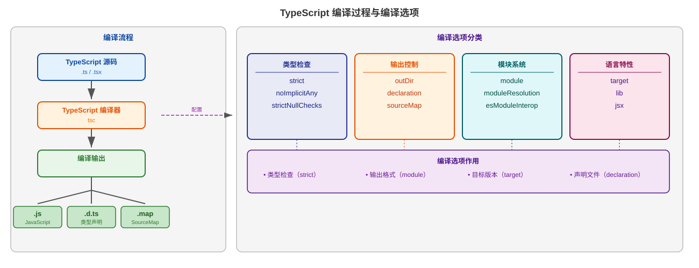
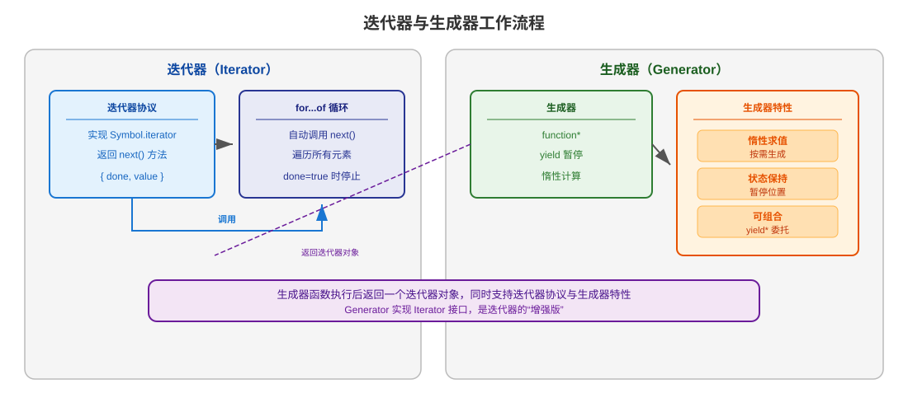

# TS学习笔记
**安装**

```bash
npm install -g typescript
```
安装完成后，使用一下命令查看版本
```bash
tsc -v
```
**hello world**
新建一个helloworld.ts的文件，内容如下:
```typescript
var message:string = "hello world"
consolo.log(message)
```
.`ts`的文件后缀一般都是TypeScript代码文件的扩展名.执行一下命令可以经TS转换为JS代码
```bash
tsc hellowolrd.ts
```

TypeScript 的一些关键特性：

- **静态类型检查**：TypeScript 在编译时就会检查代码的类型是否匹配，能够发现很多潜在的错误。即使是简单的错误（例如拼写错误或类型不一致），也可以在编写代码时被捕获到。
- **类型推断**：TypeScript 能够自动推断变量的类型。比如当你声明一个变量并赋值时，TypeScript 会根据赋值来推断这个变量的类型，不需要每次都显式声明类型。
- **接口和类型定义**：TypeScript 提供了 `interface` 和 `type` 关键字，允许你定义复杂的数据结构。这对于项目中不同部分的代码协作和数据交互来说非常重要。
- **类和模块支持**：TypeScript 支持面向对象编程中的类（class）概念，增加了构造函数、继承、访问控制修饰符（如 `public`、`private`、`protected`），并且支持 ES 模块化规范。
- **工具和编辑器支持**：TypeScript 拥有良好的编辑器支持，特别是与 Visual Studio Code 集成时，能提供智能提示、自动补全、重构等工具，使开发过程更高效。
- **兼容 JavaScript**：TypeScript 是 JavaScript 的超集，这意味着所有合法的 JavaScript 代码都是合法的 TypeScript 代码。这使得 JavaScript 项目可以逐步迁移到 TypeScript，而无需完全重写。

基础语法和js类似。

**tsconfig.json**

用于指定编译选项和项目设置

baseconfig

```json
{
    "compilerOptions": {
        "target": "ES2020",
        "module": "commonjs",
        "strict": true,
        "outDir": "./dist",
        "rootDir": "./src"
    },
    "include": ["src/**/*"],
    "exclude": ["node_modules", "dist"]
}
```

配置说明：

- **target：**编译目标 JavaScript 版本
- **module：**使用的模块系统
- **strict：**启用所有严格类型检查
- **outDir：**输出目录



### 迭代器




### Promise
注意事项：
泛型参数：始终为Promise知道泛型参数，明确返回类型
错误处理: 记得使用catch处理Promise失败的情况
all vs allSetted: 需要全部结果时使用allSetted,需要快速失败时使用all
async/await：现代代码推荐使用async/await,语法更简单
总结
Promise 是 TypeScript 异步编程的核心。

Promise：异步操作容器，有 pending/fulfilled/rejected 三种状态
then/catch：链式处理异步结果
Promise.all：等待全部完成，任一失败则整体失败
Promise.race：返回最先完成的结果
Promise.allSettled：等待全部结束，返回每个的状态
建议：使用 async/await 语法配合 Promise，让异步代码既类型安全又易于阅读。